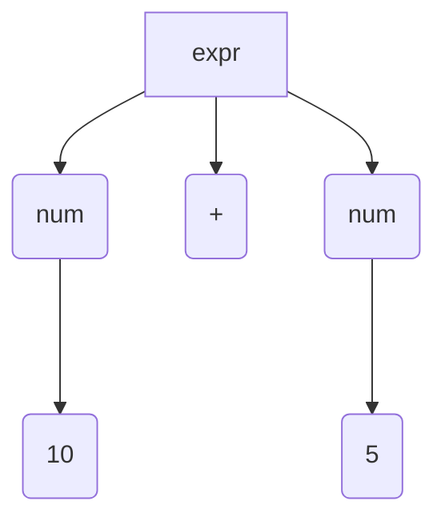
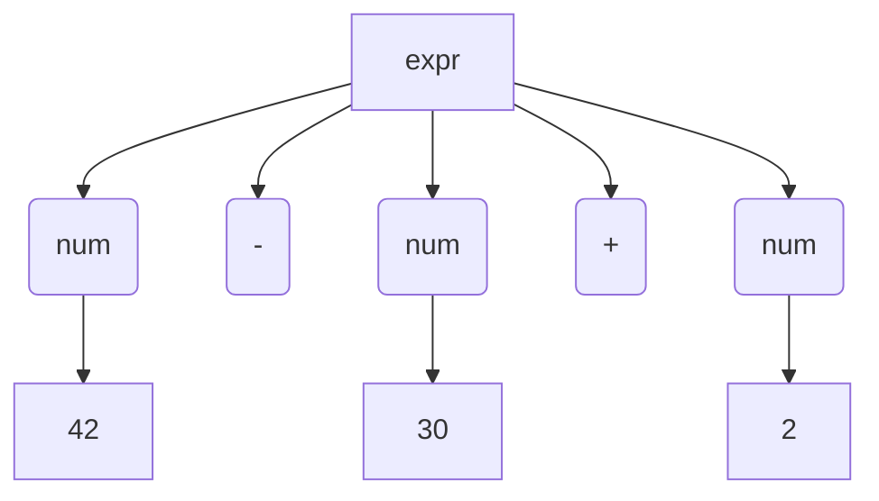
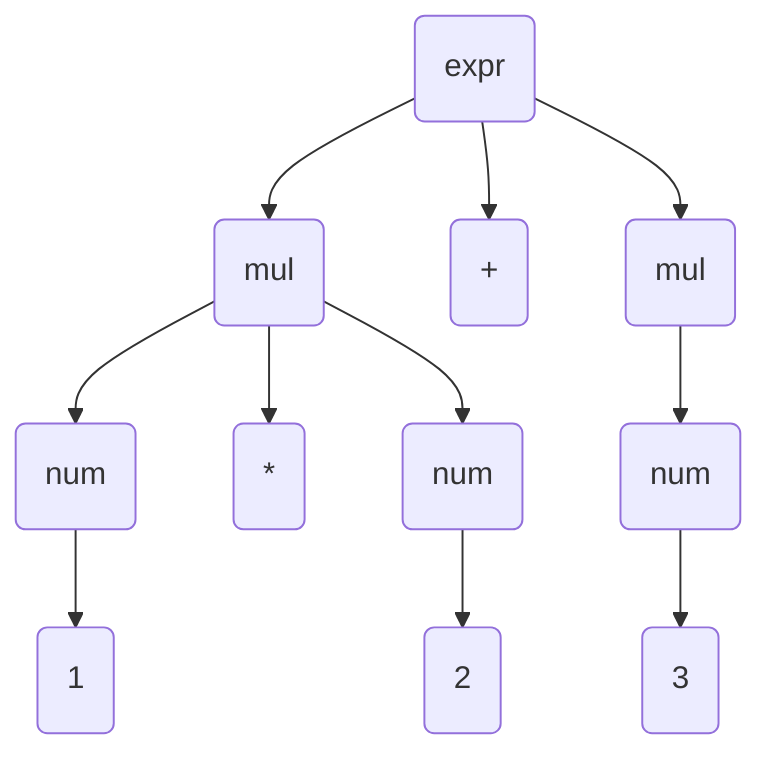
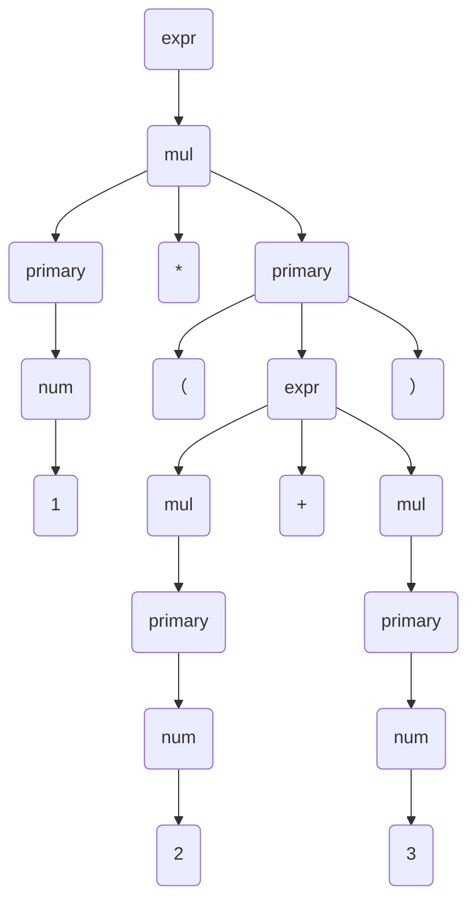

# Step4: エラーメッセージを改良
```
・現在はどこにエラーがあったのかわからない
・入力の何バイト目がエラーだったのか知りたい
・解決策として文字列全体をuser_inputに保存する
```
- 変更点
```
error関数 -> error_at

```
- コード本体
```c
#include <ctype.h>
#include <stdio.h>
#include <stdarg.h>
#include <stdbool.h>
#include <stdlib.h>
#include <string.h>

//トークンの種類(0~3)
typedef enum{
  TK_RESERVED,  //記号
  TK_NUM,       //整数トークン
  TK_EOF,       //入力終了トークン
} TokenKind;

typedef struct Token Token;

//Tokenkindには(0~3)が入る
struct Token {
  TokenKind kind; //トークンの型(enumより)
  Token *next;    //次の入力トークン(次の構造体のアドレス)
  int val;        //kindがTK_NUMの場合、その数値
  char *str;      //トークン文字列
};

//入力文字列
char *user_input;

//現在着目しているトークン
Token *token;

//エラー箇所の報告(*locは現在のpointer)
void error_at(char *loc, char *fmt, ...){
  va_list ap;
  va_start(ap, fmt); //apがさす位置はfmtとなる

  int pos = loc - user_input; //つまり、posには何文字進んだかが入る
  fprintf(stderr, "%s\n", user_input);
  fprintf(stderr, "%*s", pos, "");//pos個の空白(*は、第二引数の文字列分、第3引数を表示。足りないなら空白パディング)
  fprintf(stderr, "^ ");
  vfprintf(stderr, fmt, ap);  //可変個数の引数を指定した書式(第二引数)に従って、第1引数に返す
  fprintf(stderr, "\n");
  exit(1);
}

// 次のトークンが期待している記号の時はトークンを1つ進めて真
// それ以外の場合は偽を返す
bool consume(char op){
  if (token->kind != TK_RESERVED || token->str[0] != op){
    return false;
  }
  //次のtokenへ
  token = token->next;
  return true;
}

// 次のトークンが期待している記号の時はトークンを1つ進めて真
// それ以外の場合はエラーを報告する(expectedが-確定になる)
bool expect(char op){
  if (token->kind != TK_RESERVED || token->str[0] != op){
    error_at(token->str, "expected '%c'", op);
  }
  //次のtokenへ
  token = token->next;
}

// 次のトークンが数値の場合、トークンを1つ進めて数値を返す
// それ以外の場合はエラーを報告する
int expect_number(){
  if (token->kind != TK_NUM){
    error_at(token->str, "expected a number");
  }
  //次のtokenへ
  int val = token->val;
  token = token->next;
  return val;
}

//tokenがEOFなら真を返す
bool at_eof(){
  return token->kind == TK_EOF;
}

// 新しいトークンを作成してcurにつなげる
// cur.next 
// 構造体の情報はcallocでメモリを確保しているので格納され続ける
Token *new_token(TokenKind kind, Token *cur, char *str){
  Token *tok = calloc(1, sizeof(Token));
  tok->kind = kind;
  tok->str = str;
  cur->next = tok;
  return tok;
}

// 入力文字列pをトークナイズし、それを返す
Token *tokenize(){
  char *p = user_input;
  Token head; //トークンのリストの先頭を指す。head.nextで先頭
  head.next = NULL;
  //一回目のloopではculがheadのアドレスを指しているので
  //head.nextは連結リストの先頭を指す。それ以降は
  //curはheadのアドレスを指していないので変更されない
  Token *cur = &head; 
  //空白文字のスキップ
  while (*p){
    if (isspace(*p)){
      p++;
      continue;
    }
    if (*p == '+' || *p == '-'){
      //ポストインクリメントなので、式で使用された後に増加させる
      //一回目 cur = head 
      //       cur.next = first_tok
      //二回目 cur = first_tok 
      //       cur.next = another_tok
      //以上のように連結されていく
      cur = new_token(TK_RESERVED, cur, p++);//トークン作成
      continue;
    }

    if(isdigit(*p)){
      cur = new_token(TK_NUM, cur, p);
      cur -> val = strtol(p, &p, 10); //数値を返す
      continue;
    }

    error_at(p, "expected a number");
  }
  //末尾の場合、記号で終わることはないのでpはstrtolで範囲外を示しているはずだ
  new_token(TK_EOF, cur, p);
  //連結リストの最初の要素アドレスを返す
  return head.next;
}

int main(int argc, char **argv){
  if(argc != 2){
    //引数の個数
    error("%s: invalid number of arguments", argv[0]);
    return 1;
  }
  //トークナイズする
  user_input = argv[1];
  token = tokenize();

  //アセンブリの前半部分を出力
  printf(".intel_syntax noprefix\n");
  printf(".globl main\n");
  printf("main:\n");

  //式の最初は数である必要があるのでチェック
  //最初のmov命令を出力
  printf("  mov rax, %d\n", expect_number());

  // -<num> +<num>という並びを消化する
  while (!at_eof()){
    if (consume('+')){
      printf("  add rax, %d\n", expect_number());
      continue;
    }
    //もしマイナスでもなければerror
    expect('-');
    printf("  sub rax, %d\n", expect_number());
  }

  printf("  ret\n");
  return 0;
}
```

- 可変長引数についてのおさらい
```c

//呼び終わったらexitをしない場合、va_end()を呼ぶこと
#include <stdio.h>
#include <stdarg.h>

void func(char *arg_1, ...){
    va_list ap;
    va_start(ap, arg_1);
    printf("arg_2: %d\n", va_arg(ap, int));
    printf("arg_3: %lf\n", va_arg(ap, double));

    va_end(ap);
}

int main(void){
    char *arg_1 = "aaaaa";
    int arg_2 = 5;
    double arg_3 = 3.14;
    func(arg_1, arg_2, arg_3);
}
```

## 文法の記述方法と再帰下降構文解析
- 目標
```
・ * , / , ()を言語で追加する
・演算子の優先順位を処理する方法を考える
・⇒構文解析のテクニックについて学ぶ
```

- 構文解析について
```
・parserの出力のデータ構造を知る
・文法規則を定義するルールを学ぶ
・このルールをもとに、parserを書くテクニックを学ぶ
```

- 木構造による文法構造の表現
```
・入力はフラットなトークン列
・出力は入れ子構造を表す木

・C言語の場合、ifやwhileといった要素を入れ子にする
・木構造を使うと、単純に式の構造を表せる

・木の同じ階層が、括弧でくくられている？

・Cの場合、ほとんどの演算子は左結合であり、代入だけが右結合である。そのため木構造は左に深くなる。

```
[構文木の写真](./img/tree.png)

- 構文木
```
抽象構文木
  ・括弧などの冗長な要素を機の中に残さずにコンパクトに表現した構文木
  ・算術演算子は2分木で表現できそう
  ・関数本体の式は順次実行で何個にもなりうるのですべての子要素をフラットに持たせる

構文解析のゴール
  ・抽象構文木の構築
  ・構文解析⇒トークン列を抽象構文木に変換⇒アセンブリに変換
```

- 生成規則による文法の定義
```
生成規則
  ・文法を再帰的に定義するルール
  ・日本語において文法は入れ子構造
  ・文はさらに長い文の中に入れることが可能
  ・具体的な文について、それにマッチする展開手順を考えることで、文字列の構造を導ける
```
- チョムスキーの仮説
```
・人に言語獲得能力があるのは、生成規則を獲得するための回路がヒトにあるから
```

- BNFによる生成規則の記述
```
BNF
  ・Backus-Naur form(バッカス・ナウア記法)
  ・EBNF(Extend BNF)
  ・生成規則をコンパクトかつ分かりやすく記述するための記法

BNFの記法
  ・一つ一つの生成規則をA=α₁α₂⋯で表す
  ・これはAをα₁α₂⋯に展開できるという意味
  ・α₁α₂⋯は0個以上の記号の列で、それ以上展開できない記号とさらに展開される記号の両方を含む

終端記号
  ・それ以上展開できない記号
非終端記号
  ・いずれかの生成規則の左辺に来ていて、まだ展開できる記号

⇒以上のような生成規則で定義される文法を文脈自由文法と呼ぶ

※非終端記号は複数の生成規則にマッチしてかまわない
・A = α₁とA = α₂という二つの規則があった場合、どちらに展開していても構わない
※生成規則の右辺は空でも構わない
⇒その場合、左辺は無（長さ0の記号列）に展開される
⇒しかし分かりやすくするため、無の場合はεを右辺に置く

※文字列はダブルクォートで囲む。
⇒文字列は常に終端記号である
```

- EBNFの追加ルール
```
A* : Aの0回以上の繰り返し
A? : Aまたはε
A | B: AまたはB
(...): グループ化
```

- 具体例
```
A = ("fizz" | "buzz")*の場合は
""
"fizz"
"buzz"
"fizzbuzz"
"fizzbuzzfizz"
等にヒットする
```

- BNFとEBNF
```
・EBNFはショートカットにすぎず、生成可能な文は変わらない
・A = α(β1β2...)y ->  A = αBy ,  B = β1β2...
```

- 単純な生成規則
```
expr = num ("+" num | "-" num)*
ただし、numは数値を表す記号として別箇所で定義されているとする

・exprはnumが1つあり、その後に0個以上の+とnum,あるいは-とnumが続くもの
  ⇒加減算の式
  ⇒1, 10+5, 42-32+21

```
- 10 + 5


- 42 - 30 + 2


- 具象構文木
```
・入力に含まれるすべてのトークンを含んだ、文法に完全にマッチする構文木を指す。
・加減算を左から計算するといったルールは言語仕様書の中に但し書きで、文章の形で示す
・つまり、parserはEBNFと但し書きの両方を考慮に入れて、式を表すトークン列を読み込む

```

- 生成規則による演算子の優先順位の表現
```
expr = mul ("+" mul | "-" mul)*  // mul + mul - mul
mul = num ("*" num | "/" num)*   // num / num * num

exprはmulを経由してnumに展開される。
```
- 具体例(1*2+3)


- 説明
```
・足し算より掛け算が常に木の末端方向に現れる
・mulからexprに戻るルールを用意していないので、掛け算の下に足し算がある木を作れない。
```

- 再帰を含む生成規則
```
再帰的な文法の生成

expr = mul ("+" mul | "-" mul)*
mul = primary ("*" primary | "/" primary)*
primary = num | "(" expr ")"

・primaryは1つの数字に展開するor括弧でくくられた任意の式に展開する。

```


- 1*(2+3)の構文木


- 再帰下降構文解析
```
Cプログラムを機械的に生成する場合
  1. C言語の生成規則を与える
  2. 展開して任意のCプログラムを生成

我々がやりたいこと
  1.外部から文字列としてCプログラムが与えられる
  2.展開すると入力の文字列になる構文木の構造を知る

規則が与えられれば、構文木を求めるコードは機械的に書ける
  ⇒再帰下降構文解析法

再帰下降構文解析法でパーサを書区場合
  非終端記号1つ1つを関数1つ1つにマップする
  つまり、以下の記号がある場合
  expr = mul ("+" mul | "-" mul)*
  mul = primary ("*" primary | "/" primary)*
  primary = num | "(" expr ")"
  パーサは3つの関数を持ち、各々の関数は名前通りのトークン列をパースする
  
  ・トークン　⇒　パーサ　⇒　抽象構文木を作って返す
```
- ノードの型を定義する
```c
typedef enum{
  ND_ADD, // +
  ND_SUB, // -
  ND_MUL, // *
  ND_DIV, // /
  ND_NUM, // 整数
} NodeKind;

typedef struct Node Node;

struct Node{
  NodeKind kind;  //ノードの型
  Node *lhs;      //左辺(left-hand side)
  Node *rhs;      //右辺
  int val;        //kindがND_NUMの場合に使用
}
```
- 新しいノードを作成する関数
```c
//左辺と右辺を受け取るもの
Node *new_node(NodeKind kind, Node *lhs, Node *rhs){
  Node *node = calloc(1, sizeof(Node));
  node->kind = kind;
  node->lhs = lhs;
  node->rhs = rhs;
  return node;
}
//数値
Node *new_node_num(int val){
  Node *node = calloc(1, sizeof(Node));
  node->kind = ND_NUM;
  node->val = val;
  return node;
}
```
- exprを定義する
```c
// +や-は左結合の演算子
//consumeは次のトークンが引数とマッチするときに入力を1トークン進めるもの
Node *expr(){
  Node *node = mul();

  for(;;){
    //左辺が前のノードで、右辺がmul()の結果
    if(consume('+'))
      node = new_node(ND_ADD, node, mul());
    else if(consume('-'))
      node = new_node(ND_SUB, node, mul());
    else
      return node;
  }
}

```

- mulを定義する
```c
Node *mul(){
  Node *node = primary();
  for (;;){
    if (consume('*'))
      node = new_node(ND_MUL, node, primary());
    else if (consume('/'))
      node = new_node(ND_DIV, node, primary());
    else
      return node; 
  }
}
```
- primaryを定義する
```c
Node *primary(){
  if(consume('(')){
    Node *node = expr();
    expect(')');
    return node;
  }
  return new_node_num(expect_number());
}
```
- 1+2*3をparseする
```
1. 式全体はexprなので、exprを呼ぶ。for(;;)なので終わるまで読まれる
2. mulが呼ばれる
3. primaryが呼ばれる
4. 1がexprまで返る
5. exprのif(consume('+'))が真になる
6. +トークンが消費され、右辺でmulが呼ばれる
7. primaryが呼ばれる
8. 2がmulに返る
9. if(consume('*'))が真になる
10. *トークンが消費され、右辺でprimaryが呼ばれる
11. 3がmulに返る
12. 2*3を表す構文木がexprに返る
13. 組み合わされて1+2*3となったものがexprから返る
```
- 呼び出し関係の図
```
1         +       2       *       3
[primary]         [primary]       [primary]
[mul]             [        mul            ]
[                  expr                   ]
```