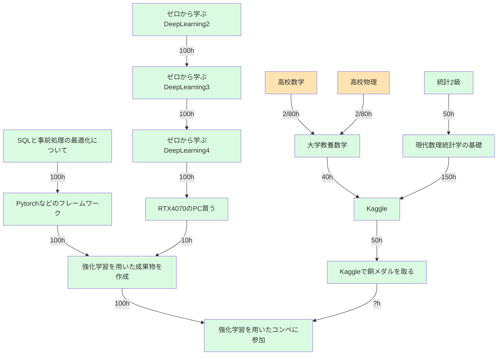
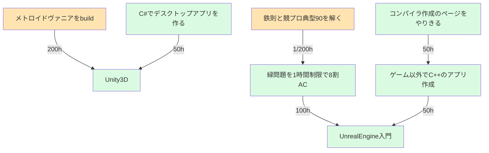
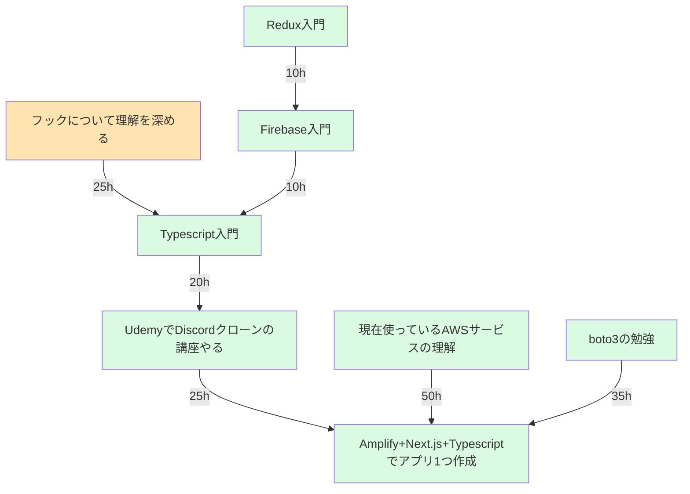
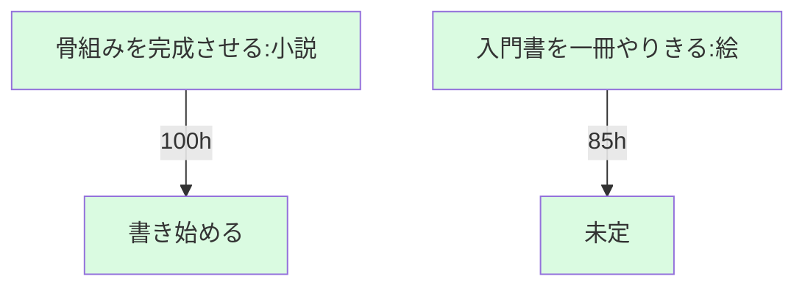

- 現在の学習時間(2024/1/1 ~ 2024/12/31)
```
合計
    5h / 1850h
React関係
    0h / 175h

※ 合計時間は増える可能性あり
※ Progressに変わったら各項目について 5h / 180hという風にしていく
※ 次への矢印がない場合、該当項目については2025年度に実施する
※ 1日の最後or次の日の最初に変更する事
※ 目安: 平日2.5時間。休日10時間

各種リポジトリ
    React関係
        : react-app-dev
    Deep-learning:
        : 未定
    数学・物理・統計
        : My-learning
    競プロ
        : My-learning
    ゲーム関係
        : private
    その他
        : private


```

- DeepLearningのロードマップ(2024年末まで)

- ゲーム && 競プロ関連ロードマップ


- React関係ロードマップ


- その他


