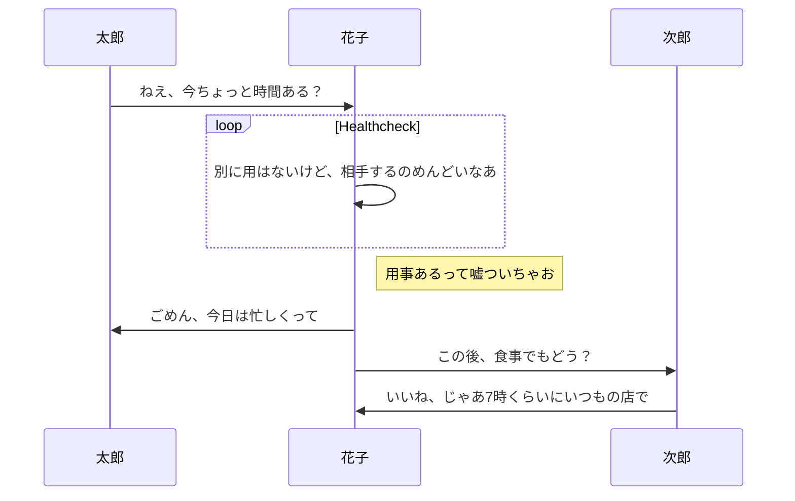
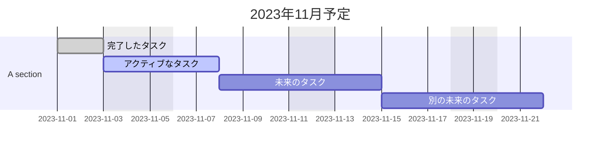
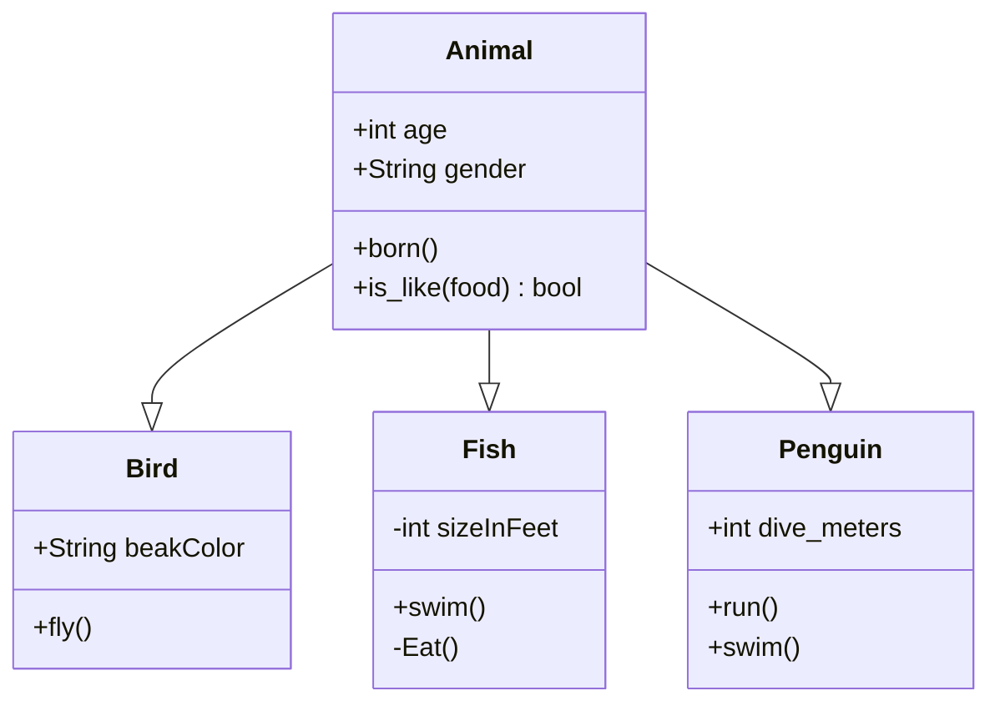
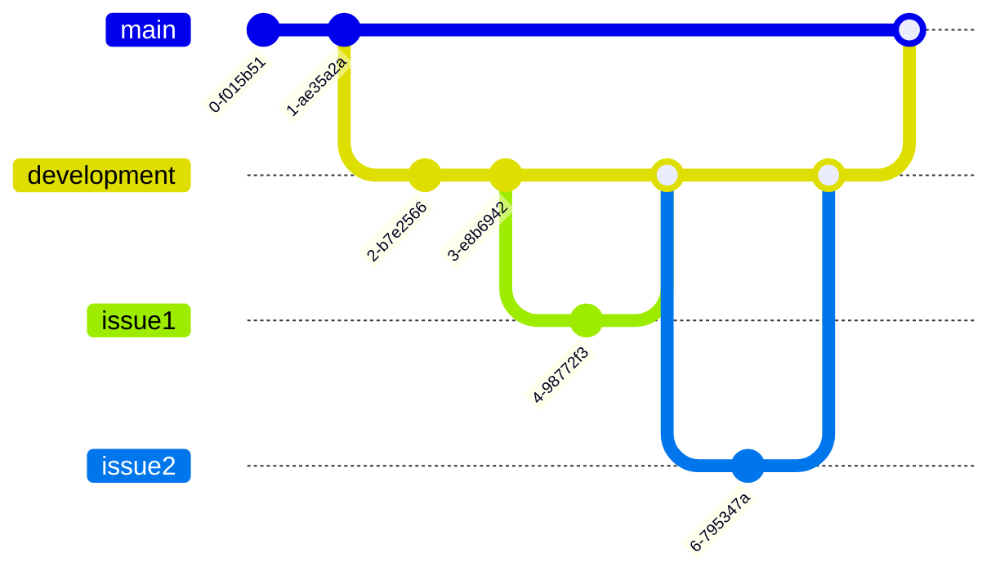
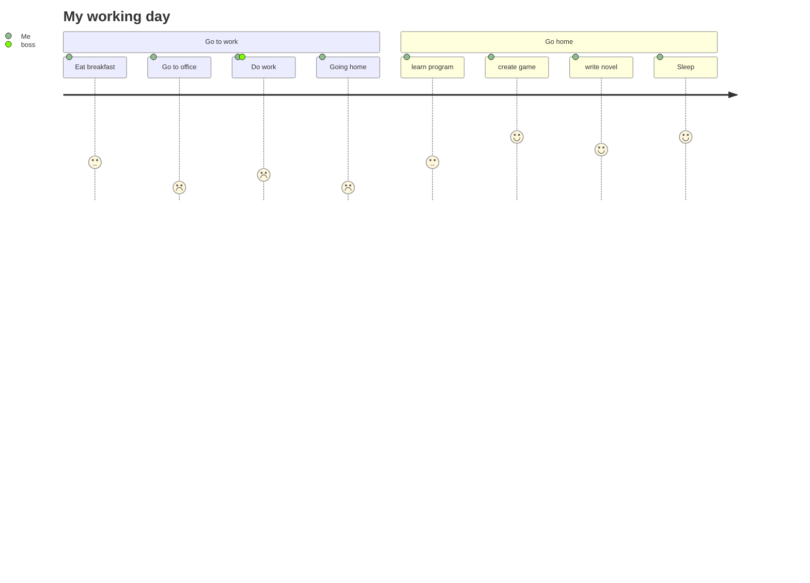
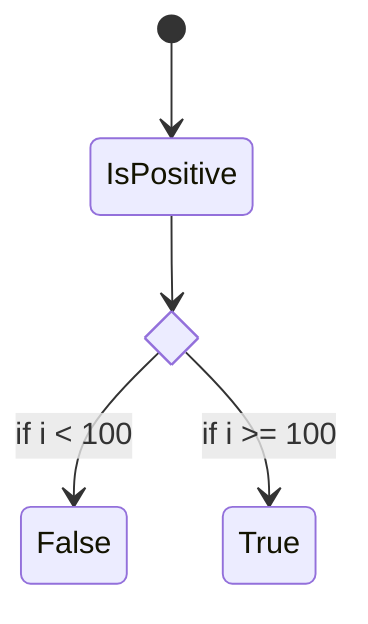
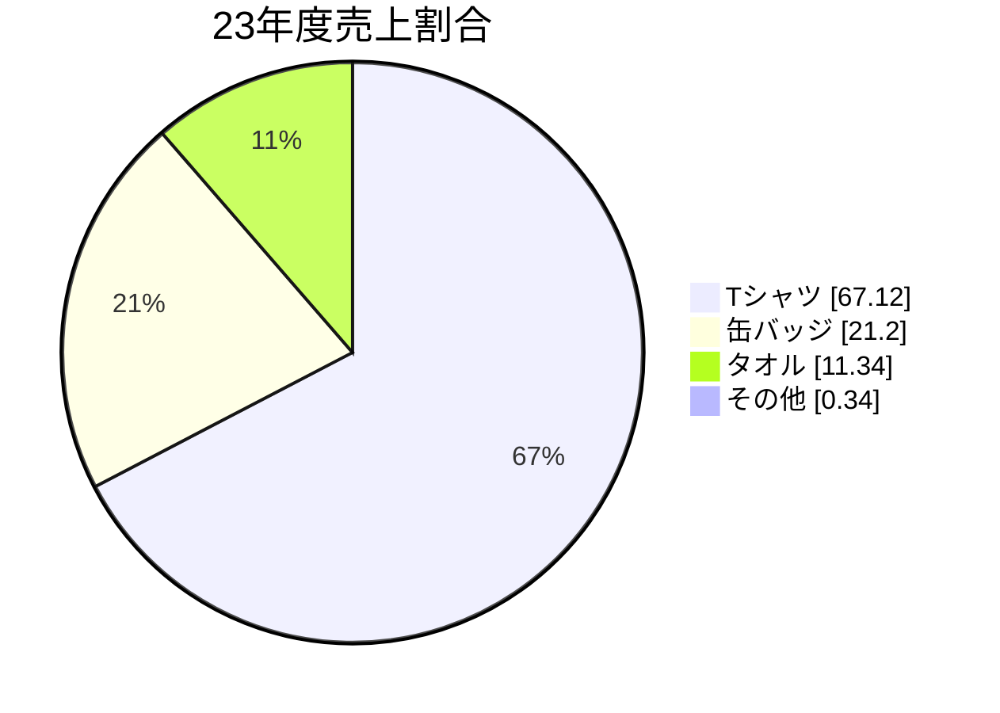
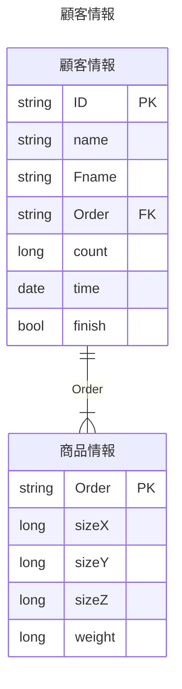
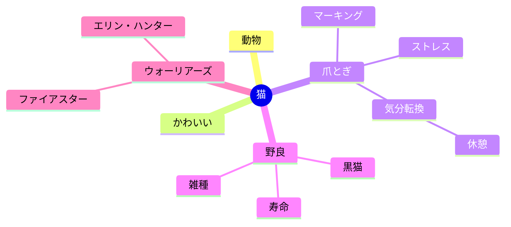

## フローチャート


## シーケンス図
```
participantに追加した順番に左から表示されるっぽい
Note right ofで説明を追加
```


## ガントチャート
```
excludesで休日や祝日を考慮する
weekendsで休日を省く
```


## クラス図


Gitグラフ


## ユーザージャーニー図


## ステータス図


## 円グラフ


## ER図
```
0| 最小値0,　最大値1
0{ 最小値0, 最大値上限なし
```


## Mindmap
